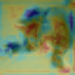
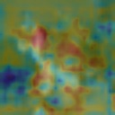

# CAM

```bash
$> floyd run --gpu --env pytorch-0.4 'python main.py'

# cifar10을 다운로드 받는 시간이 부족하다면
$> floyd run --gpu --env pytorch-0.4 --data ririau/datasets/pytorch-cifar10-dataset/2 'python main.py --data_root=/input'
```

## Result
 
 